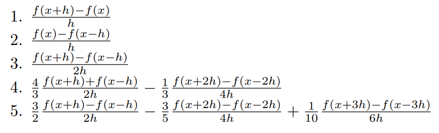
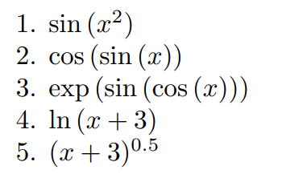
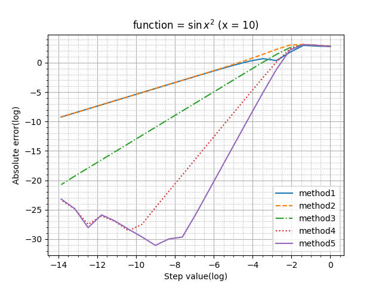
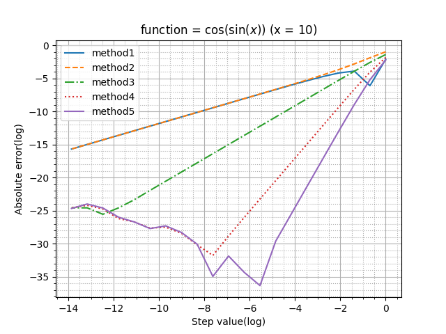
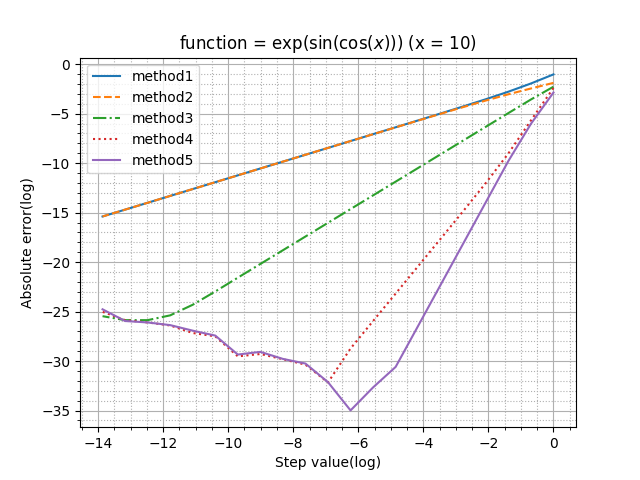
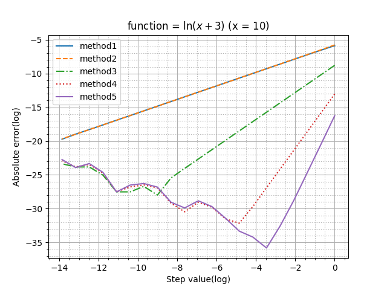
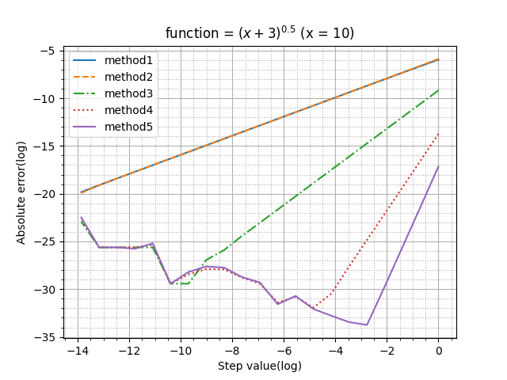

## Отчет по выполнению первой лабораторной работы по вычислительной математике

Целью данной работы было исследование разных численных методов подсчета производных. Для этого было предоставлено пять различных формул производных:

Для исследования были взяты следующие функции в точке x = 10:

.

### Ход работы

#### Первая функция

#### Вторая функция

#### Третья функция

#### Четвертрая функция

#### Пятая функция

### Выводы

Из анализа графиков получим, что первый и второй метод вычисления производной дают одинаковые результаты почти на всей области анализа, при этом в целом их погрешность самая большая среди всех методов. 
Третий, четвертый и пятый метод имеют одинаково малую погрешность на начальном участке, однако потом сначала третий, а потом и четвертый метод начинают давать сильно большую погрешность. 

Самым точным методом оказался пятый.

По характеру зависимости видно, что минимум погрешности наблюдается не при минимальном шаге относительно нашего базового значения x = 10.