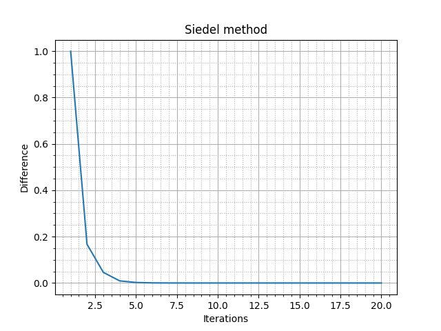

## Отчет по выполнению лабораторной работы №2. Методы решения СЛАУ.
    Note: В качестве СЛАУ был выбран пункт "к".

Целью данной работы было исследование различных методов решения СЛАУ. 

В качестве матрицы возьмем:
|||||||||
|-|-|-|-|-|-|-|-|
1.000000 | 0.333333 | 0.250000 | 0.200000 | 0.166667 | 0.142857 | 0.125000 | 0.111111 | 0.100000 | 0.090909 
0.333333 | 1.000000 | 0.200000 | 0.166667 | 0.142857 | 0.125000 | 0.111111 | 0.100000 | 0.090909 | 0.083333 
0.250000 | 0.200000 | 1.000000 | 0.142857 | 0.125000 | 0.111111 | 0.100000 | 0.090909 | 0.083333 | 0.076923 
0.200000 | 0.166667 | 0.142857 | 1.000000 | 0.111111 | 0.100000 | 0.090909 | 0.083333 | 0.076923 | 0.071429 
0.166667 | 0.142857 | 0.125000 | 0.111111 | 1.000000 | 0.090909 | 0.083333 | 0.076923 | 0.071429 | 0.066667 
0.142857 | 0.125000 | 0.111111 | 0.100000 | 0.090909 | 1.000000 | 0.076923 | 0.071429 | 0.066667 | 0.062500 
0.125000 | 0.111111 | 0.100000 | 0.090909 | 0.083333 | 0.076923 | 1.000000 | 0.066667 | 0.062500 | 0.058824 
0.111111 | 0.100000 | 0.090909 | 0.083333 | 0.076923 | 0.071429 | 0.066667 | 1.000000 | 0.058824 | 0.055556 
0.100000 | 0.090909 | 0.083333 | 0.076923 | 0.071429 | 0.066667 | 0.062500 | 0.058824 | 1.000000 | 0.052632 
0.090909 | 0.083333 | 0.076923 | 0.071429 | 0.066667 | 0.062500 | 0.058824 | 0.055556 | 0.052632 | 1.000000

### Прямой метод решения

В качестве прямого метода решения СЛАУ был использован метод Гаусса. Метод Гаусса дает невязку ~ 0 при точности в 6 десятичных знаков.

### Итерационные методы

Все методы выполнялись в 20 итераций, т.к. при уже при 20 невязка ответа была ~ 0.

1) ***Метод Зейделя*** \

2) ***Метод Якоби*** \
Т.к. у нашей матрицы не выполняется условие диагонального преобладания, то метод Якоби не будет сходится, что хорошо видно на графике. \

### Выводы

Из анализа графиков получим, что метод Зейделя довольно быстро сходится и уже с пятой итерации показывает невязку ~ 0. Метод Якоби же вообще не сходится, поэтому с каждой итерацией его невязка только растет.