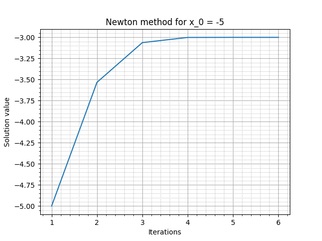
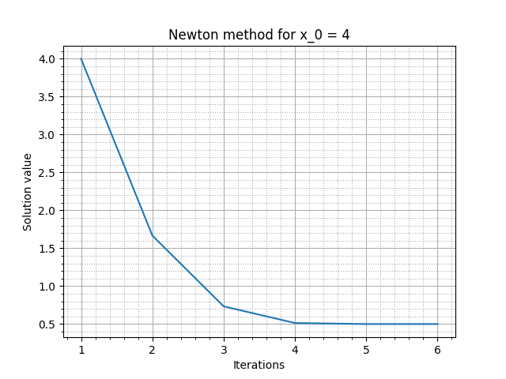
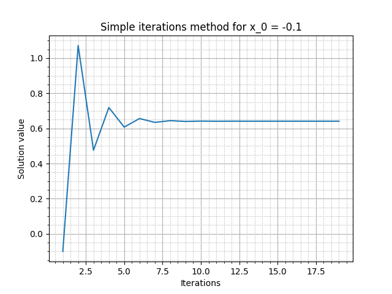
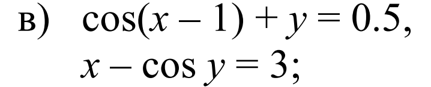

## Отчет о выполнение лабораторной работы №3. Итерационные методы решения уравнений.

Целью данный работы является исследование точности и скорости сходимости различных итерационных методов решения уравнений и СЛАУ.

### Метод Ньютона для уравнений.

В качестве уравнения возьмем:

.png)

Решать уравнение будем с точность до 6 знаков после запятой.

Как видно из графиков, для довольно точного результата методу Ньютона достаточно не более 10 итераций. Это говорит о крайне высокой скорости сходимости данного метода.

### Метод простой итерации для уравнений.

Т.к. прошлое уравнение невозможно решить методом простой итерации, возьмем другое:

.png)

Решени аналогично проводим до 6 знаков после запятой.

Видно, что МПИ тоже сходится довольно быстро, но ему требуется гораздо больше итераций, чем методу Ньютона, поэтому его скорость сходимости не так высока.

### Метод Ньютона для СНАУ.

В качестве системы уравнений возьмем:

Данное уравнение можно решить и методом Ньютона, и с помощью МПИ, поэтому результат будет особо показателен.

Метод Ньютона сошелся практически моментально. Скорость сходимости очень высокая.

### Метод простой итерации для СНАУ.

Решаем все то же уравнение.

МПИ понадобилось порядка 30 итераций, чтобы показать точность, которой метод Ньютона добился меньше, чем за 10.

## Вывод
И метод Ньютона, и МПИ показывают хорошую точность и довльно большую скорость сходимости. Однако метод Ньютона (особенно в решении СНАУ) демонстрирует гораздо более высокую скорость сходимости, иногда опережая МПИ на порядок. 