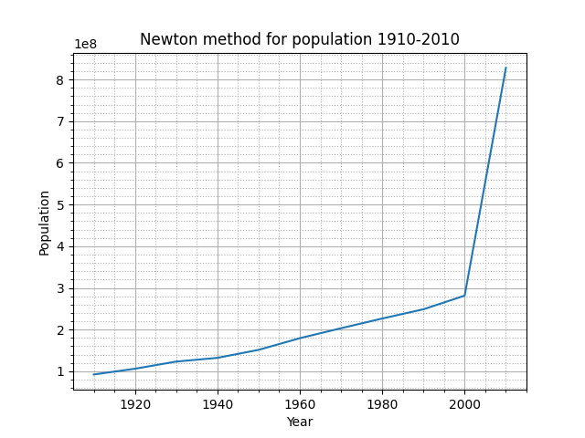
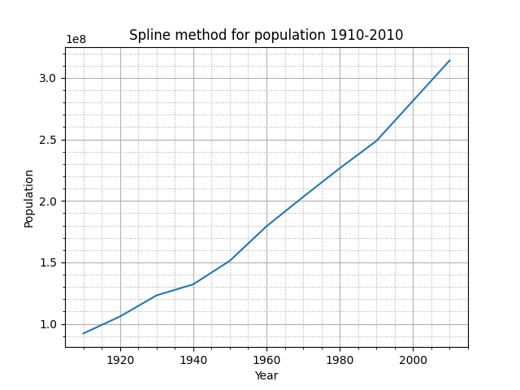
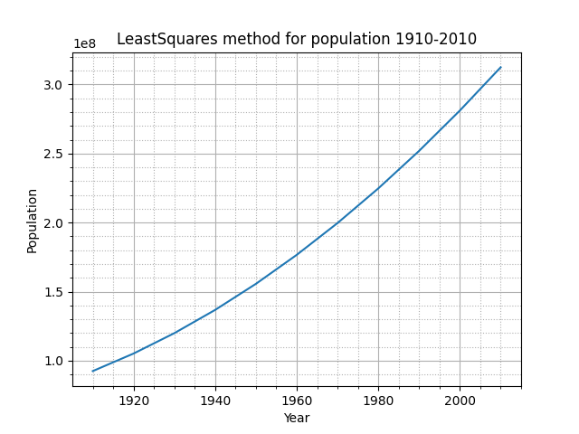

## Отчет о выполнении лабораторной работы №4. Методы интерполяции.

Целью данной работы было исследование трех различных методов интерполяции: Ньютона, кубическими сплайноми и МНК.

В качестве интерполируемых данных выступала численность населения США:

|     |             |
|-----|-------------|
|1910 |	 92 228 496 |
|1920 |	106 021 537 |
|1930 |	123 202 624 |
|1940 |	132 164 569 |
|1950 |	151 325 798 |
|1960 |	179 323 175 |
|1970 |	203 211 926 |
|1980 |	226 545 805 |
|1990 |	248 709 873 |
|2000 |	281 421 906 |

По этим данным построим графики и интерполируем нашу зависимость для вычисления значения численности населения в 2010 году. Табличное значение 308 745 538.

### Метод Ньютона
Метод Ньютона является глобальным методом интерполяции, приближая все данные одним многочленом.

Численность населения в 2010 году -- 827 906 509. 

Виден явный скачок, который показывает неточность интерполяции этим методом. Полученный результат так же значительно отклоняется от табличного значения.

### Кубические сплайны
Метод сплайнов является локальным методом интерполяции, приближая значения на разных отрезках разными многочленами.

Численность населения в 2010 году -- 314 133 938. 

График для сплайнов очень плавный, без явных скачков. Предсказание на 2010 год так же довольно сильно сходится с табличными данными.

### Метод наименьших квадратов
В качестве целевой функции был выбрал многочлен второй степени, т.к. при анализе сырых данных, они очень хорошо им аппроксимировались. 

Численность населения в 2010 году -- 312 470 336.

В конкретно нашем случае данные очень хорошо соответсвуют квадратичной зависимости, поэтому предсказанный результат крайне точно соответсвует действительность.

## Вывод
Было проведено сравнение трех методов интерполяции: Ньютона, кубическими сплайнами и МНК. Метод Ньютона показал худшую точность из всех, остальные же два метода спрогнозировали значение крайне точно.