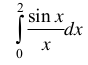

## Отчет о выполниении лабораторной работы №5. Численные методы вычисления определенных интегралов. 

В качестве функции для подсчет был использован данный интеграл:

.

Вычисления производились по данной таблице:
|x|y|
|-|-|
|0|1|
|0.25|0.989616|
|0.5 |0.958851|
|0.75|0.908852|
|1   |0.841471|
|1.5 |0.664997|
|1.75|0.562278|
|2   |0.454649|

Тремя способами: методом трапеций, методом Симпсона и экстраполяцией Ричардсона для метода трапеций.

|||
|:---|:-----|
|Метод трапеций h = 0.25| 1.603144375|
|Метод трапеций h = 0.5| 1.59632175|
|Метод Симпсона|1.6054185833333332|
|Экстраполяция Ричардсона|1.6054185833333334|

## Вывод
Все методы дают довольно близкий результат, однако легко понять, что метод Симпсона показывает большую точность, чем метод трапеций. Только используя экстраполяцию Ричардсона, удается достигнуть его точности.