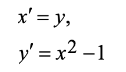
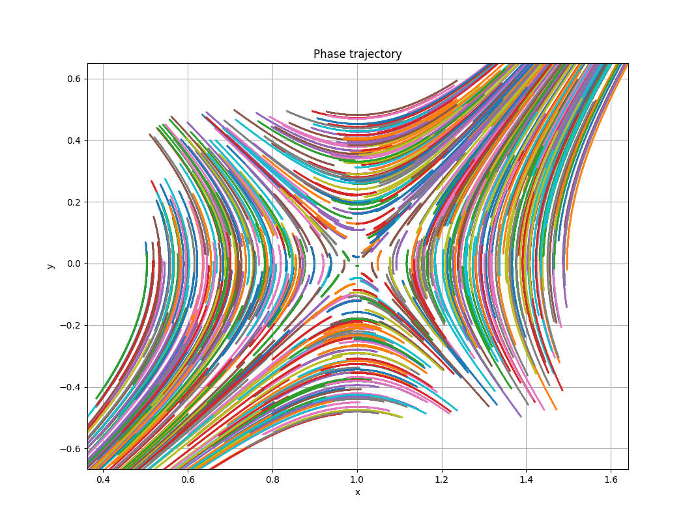
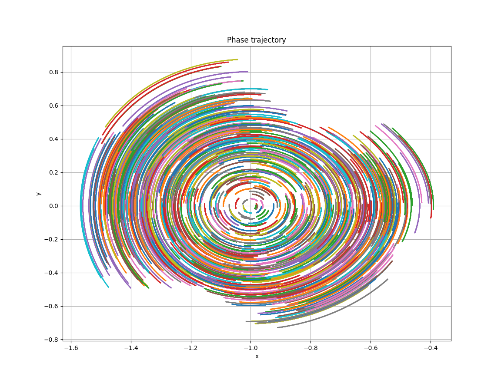
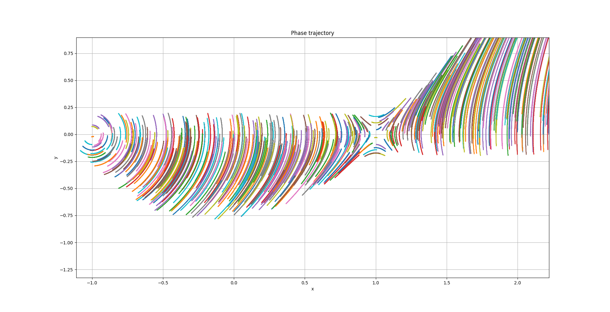
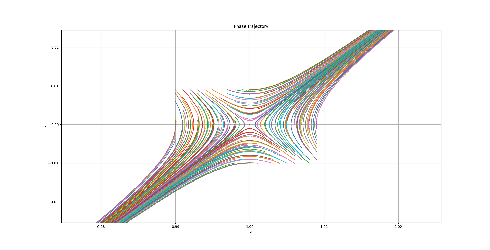
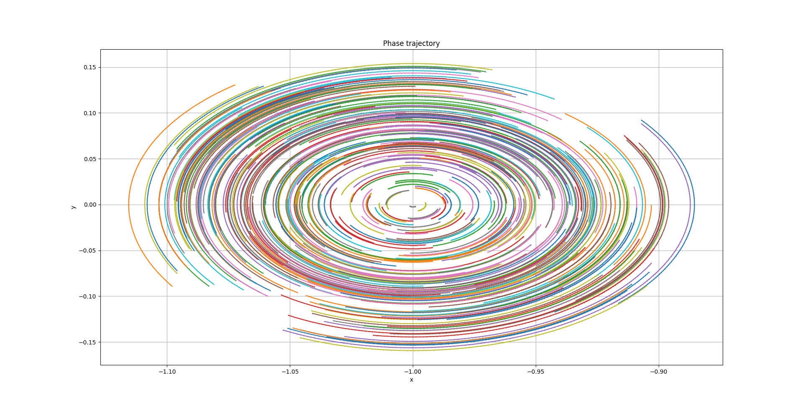
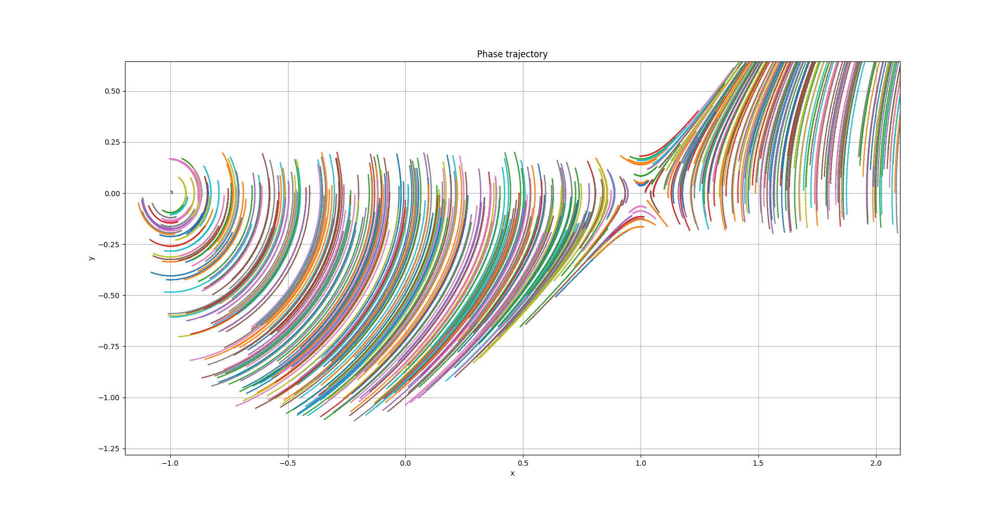
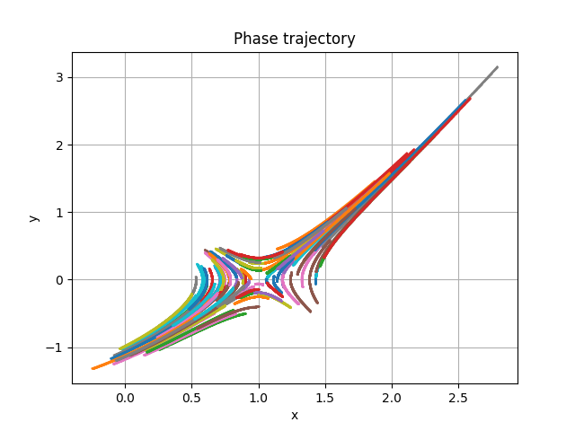
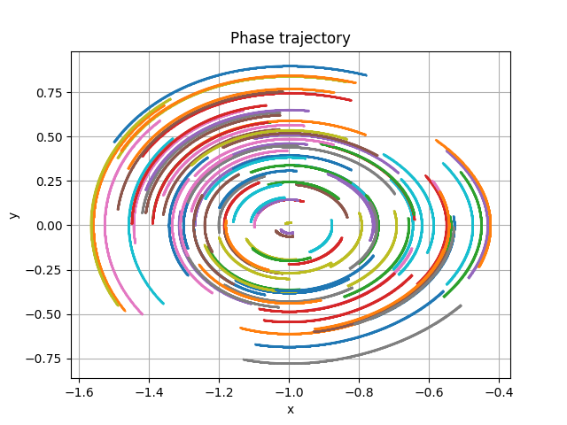
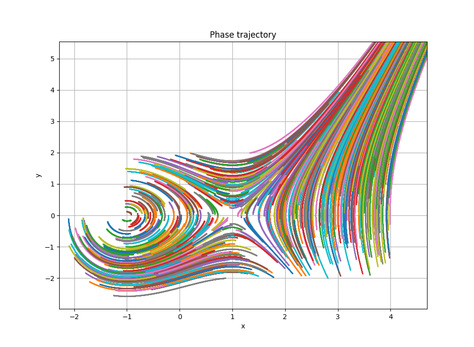

# Отчет по лабораторной работе №6. Системы ОДУ

## Постановка задачи
Для выполнения лабораторной работы был взят номер VIII.11.3

Данная система ОДУ имеет две особые точки (1, 0) и (-1, 0). Необходимо с помощью исследовать поведение фазовых траекторий вблизи этих точек методом Адамса, Рунге Кутта и ФДН.

## Метод Адамса

Поведение вблизи точки (1, 0):

Поведение вблизи (-1, 0):

Общая картина:

## Метод Рунге Кутта

Поведение вблизи точки (1, 0):

Поведение вблизи (-1, 0):

Общая картина:

## Метод ФДН

Поведение вблизи точки (1, 0):

Поведение вблизи (-1, 0):

Общая картина:

## Вывод
В целом, все методы показали один и тот же результат. Для картинок выше при построении вблизи точки (1, 0) было замерено время построения каждым из методов:

|Адамс| Рунге Кутта| ФДН |
|-----|------------|-----|
|3.9 s|1.6s        |2.9s |

Видно, что в текущей реализации метод Адамса является не самым быстрым, однако из всех представленных он обеспечивает наибольшую детализацию изображения.