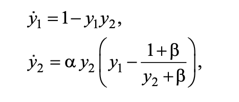
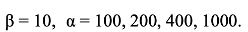
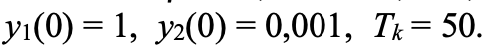

# Лабораторная работа №7. Жесткий вариант.
Вариант 10

## Постановка задачи
В данной лабораторной работе требуется решить задачу простейшей модели гликолиза с помощью методов:
    
* Рунге-Кутты
* Розенброка

Далее результат сравним с явным методом. 

## Выполнение

Система уравнений выглядит следующим образом:

Решить систему надо для следующего набора коэффициентов:

С начальными условиями: 

