# Лабораторная работа №7. Жесткий вариант.
Вариант 10

## Постановка задачи
В данной лабораторной работе требуется решить задачу простейшей модели гликолиза с помощью методов:
    
* Рунге-Кутты
* Розенброка

Далее результат сравним с явным методом. 

## Выполнение

Система уравнений выглядит следующим образом:

Решить систему надо для следующего набора коэффициентов:

С начальными условиями: 

Визуализацию удобнее всего произвести в трехмерном пространстве. Построим графики y1, y2, dy1, dy2, t при всех начальных условиях:

Для альфа = 100:

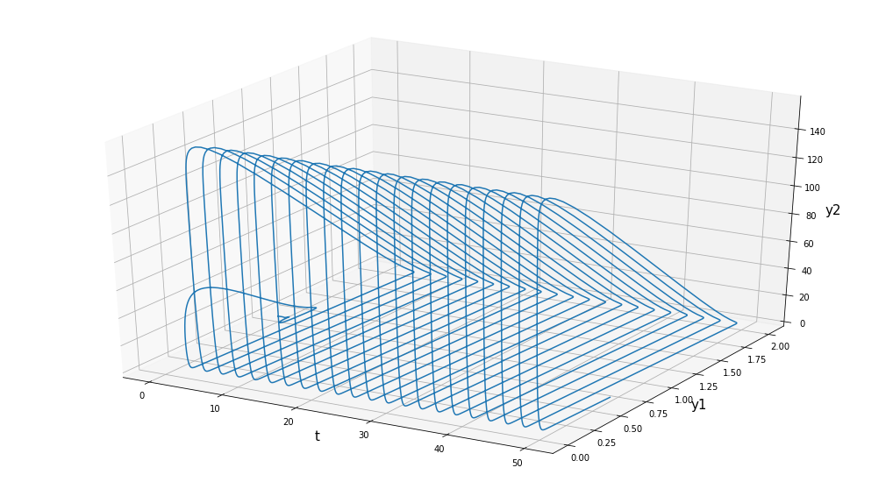
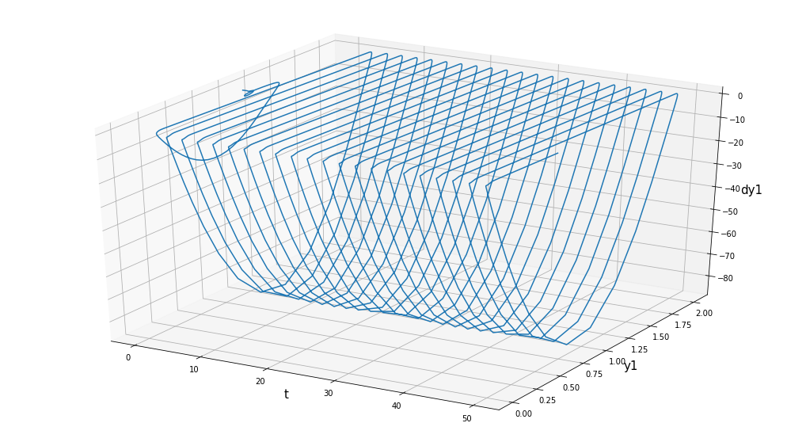
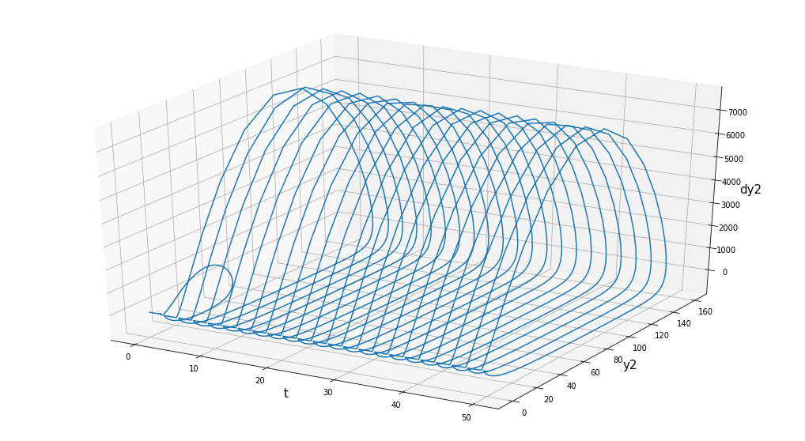

Для альфа = 200:

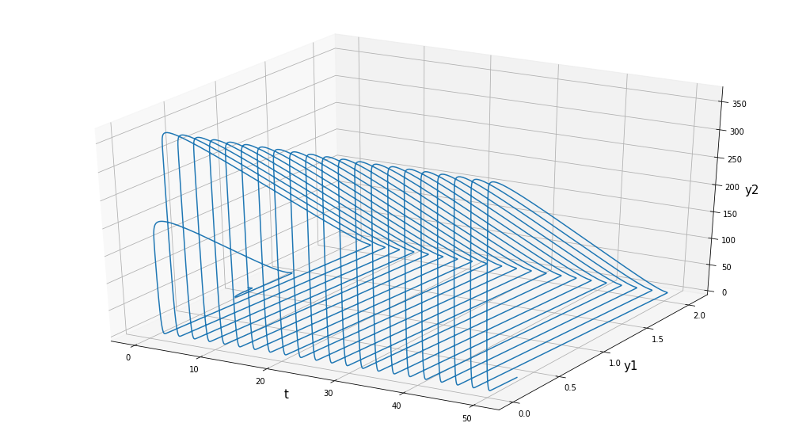
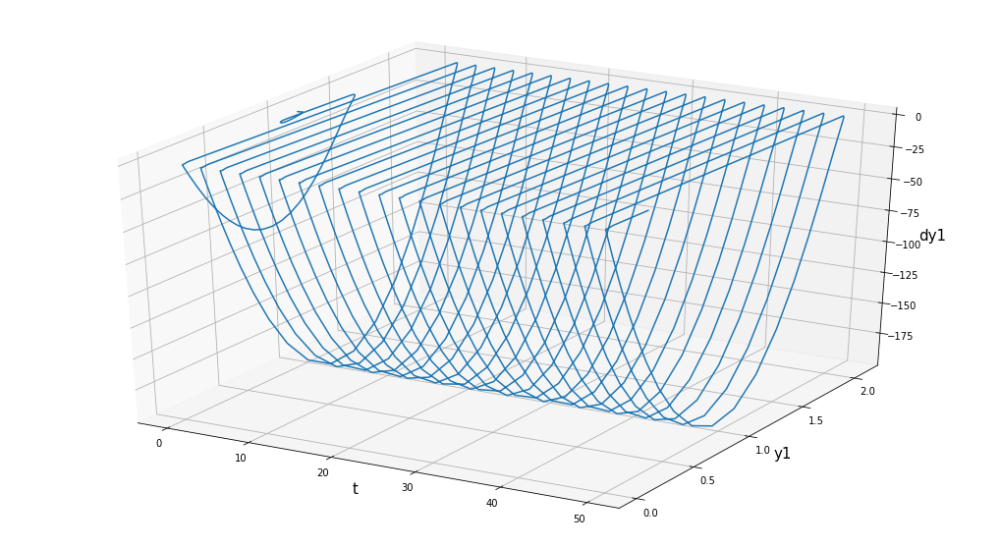
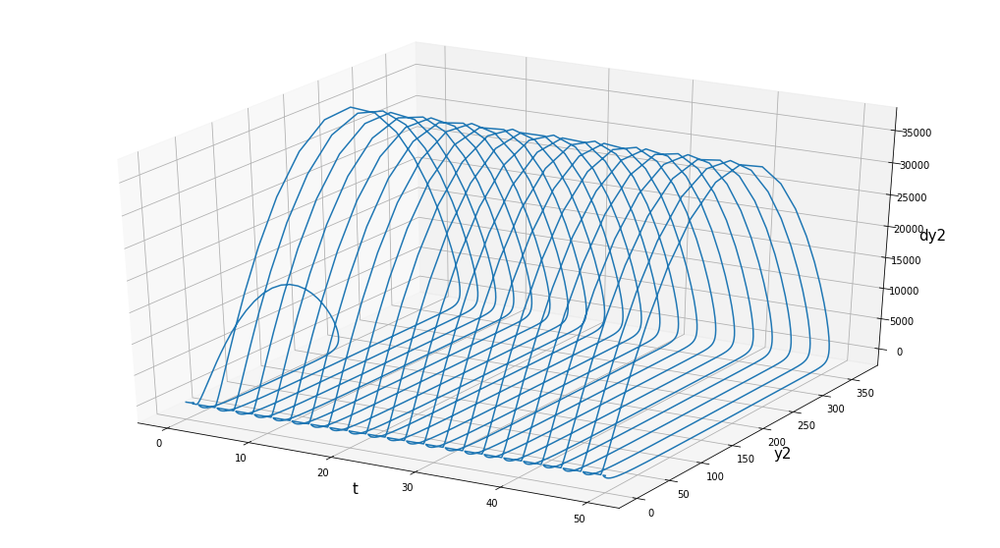

Для альфа = 400:

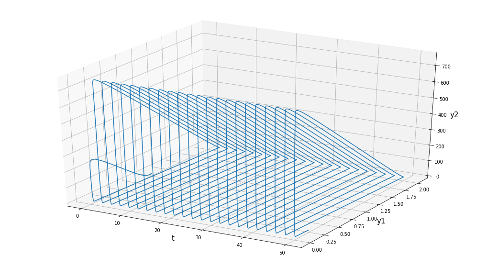
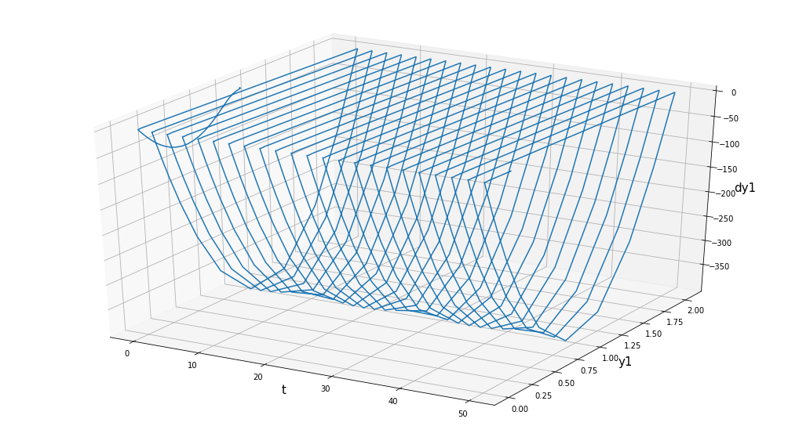
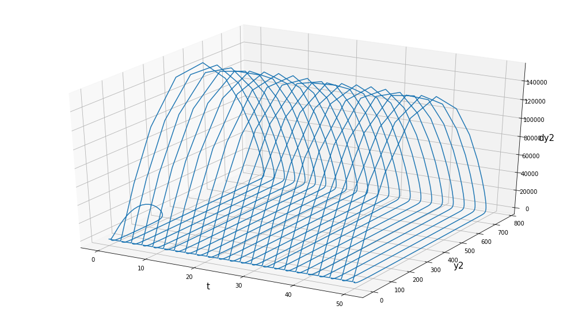

Для альфа = 1000:

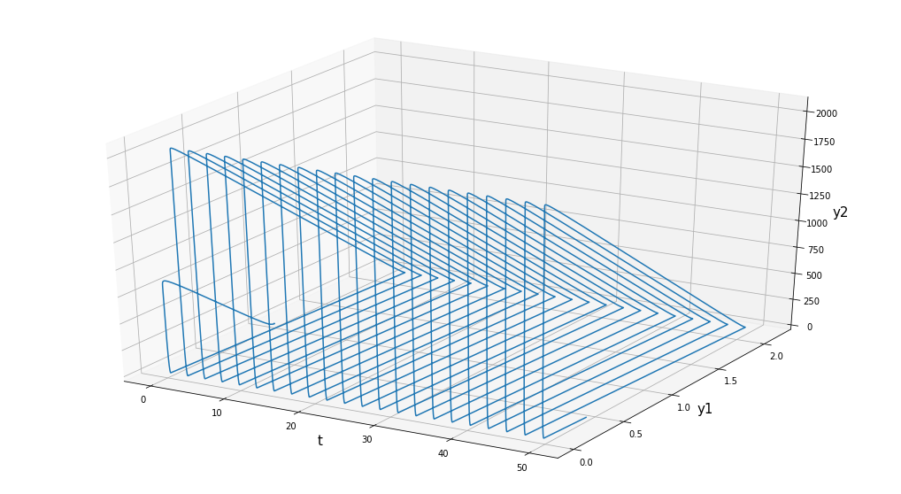
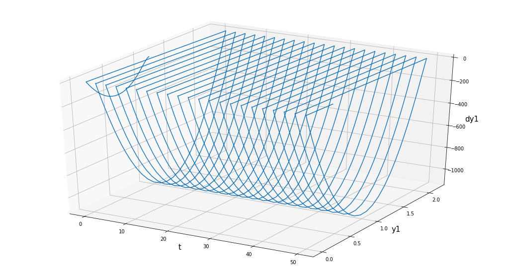
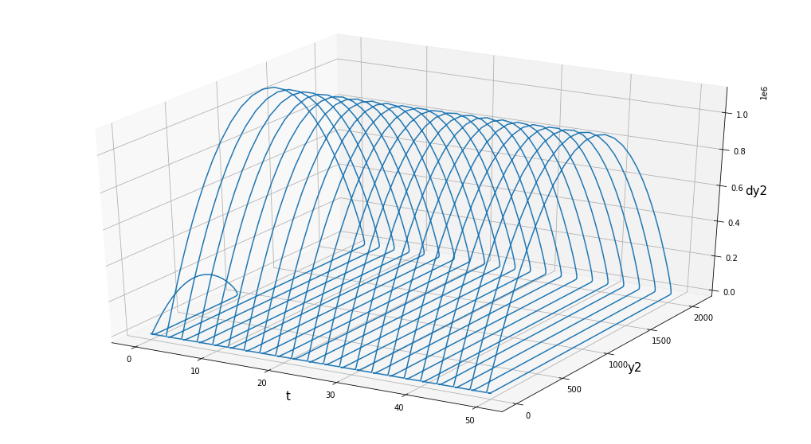

## Анализ результатов

Сравним результаты с явным методом третьего порядка. В качестве условий возьмем альфа = 100:
 
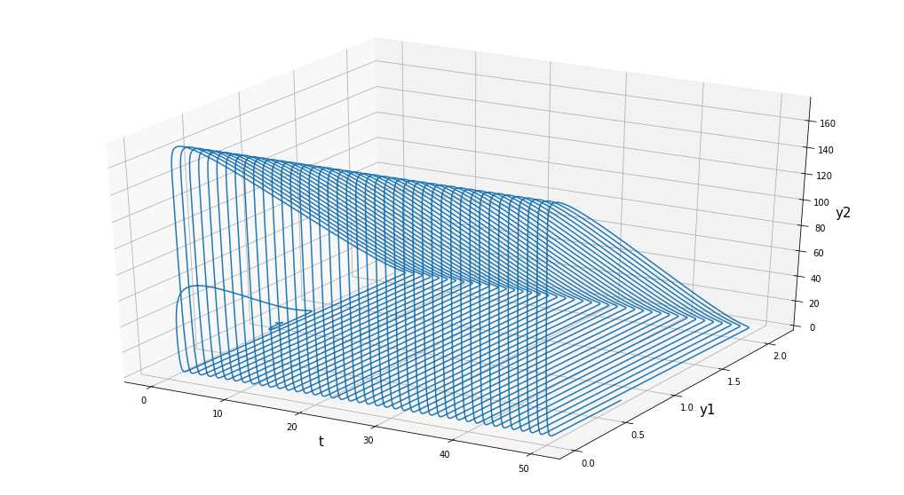
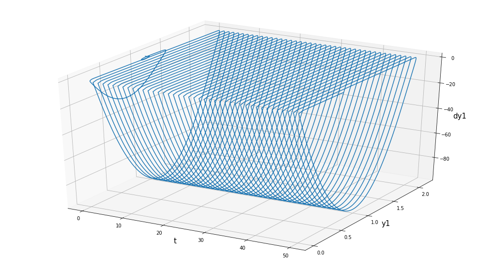
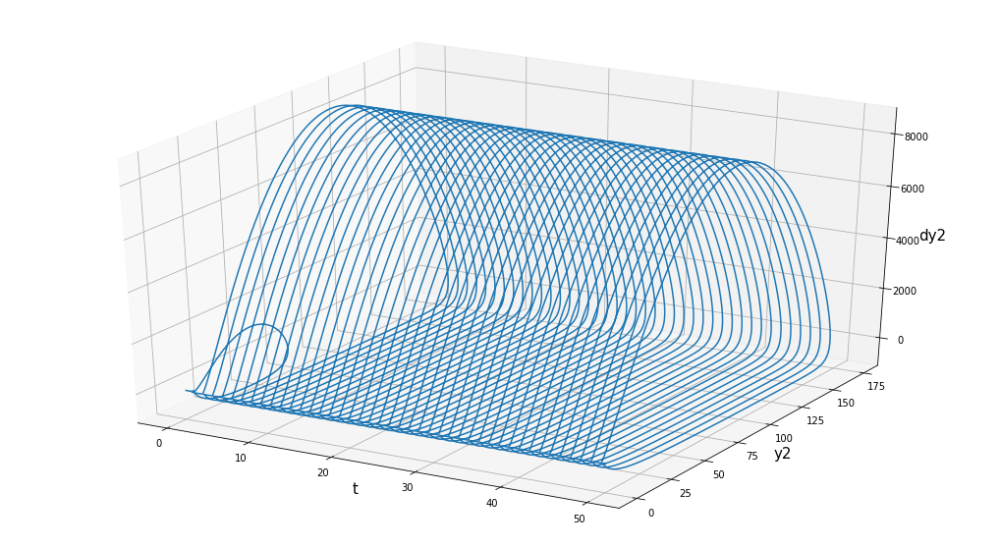

## Вывод
Видно, что вид решения совпадает довольно точно, поэтому методы можно считать подходящими под условия задачи.