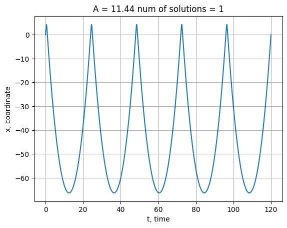
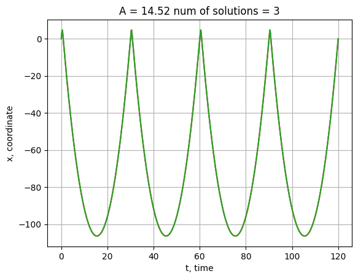
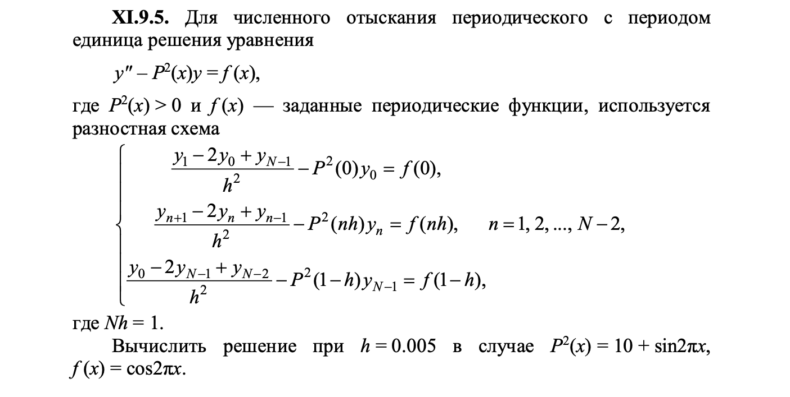
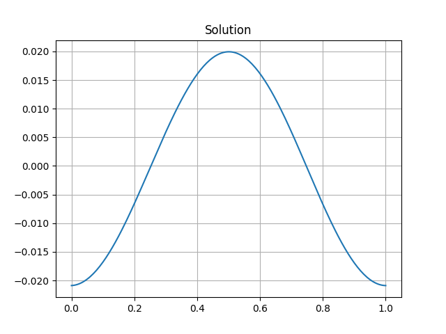

# Лабораторная работа №9. Метод прогонки.

## Вступление

В этой лабораторной работе я решил два уравнения. Были протестированы новые методы: стрельбы и прогонки. Метод стрельбы используется для решения краевых задач, при итеративном решении задачи Коши, при поиске начального значения производной, соответствующего второму граничному значению. Прогонка сама по себе не является методом, но помогает эффективнее и быстрее решать системы линейных уравнений, если только матрица системы близка к 3-диоганальной.

## Потенциал Тодда

### Постановка задачи

Для частицы в потенциальном поле:
$$U(x) = x - \exp(x), $$
найдите ВСЕ периодические решения, которые удовлетворяют следующим условиям:

$$
x(0) = 0, \space x(120) = 0 \newline
\dot{x(0)} = \dot{x(120)} = A, \space где A \ge 10
$$

### Выполнение

1) Решите независимо с помощью метода стрельбы для заданных граничных условий и проанализируем форму зависимости F(альфа).

2) На интервале T = 120 только t - делители T могут быть периодами требуемых решений. Для разных значений t F(альфа) имеет разный вид, и поэтому возможны разные решения.

_T=10.png)
_T=20.png)

3) Затем выбрали только те решения, которые обладают свойством альфа = A, удовлетворяющим вторым условиям, и дополнительно проверили наличие:

$$
\dot{x(t)} = A, \space где \space t \le 120 - период
$$

4) И наконец:

$$
A \in [10, 15] \newline
\delta A = 0.1
$$

Получим следующие решения:

Для вычисление решений для всех других значений A потребует много времени, поэтому я их не вычислял. Однако по моим наблюдениям они должны быть похожи на что-то вроде:

$$
A = 10, 15, 20,\space...
$$

### Метод прогонки

Решим следующую проблему:

Используя XI7.2, я получил следующее решение:

